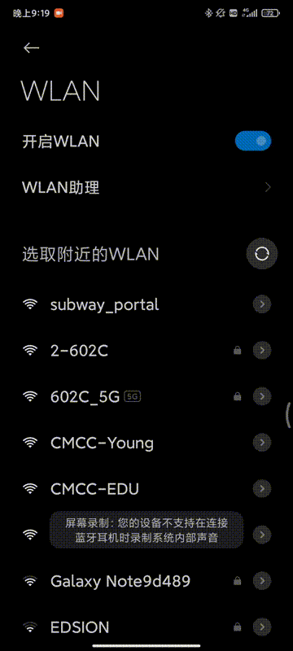

# Subway Portal

A subway wifi captive portal solution based on [Wifidog](http://dev.wifidog.org/)  


- An OOD class project assignment

# Usage
the environment and mechanics of the project are described in design document  

## **prerequisity**
> - Golang >= 1.14
> - Wifidog >= 1.13  

See [Golang](https://golang.org/) for the programming language used by this project

Before the subway portal is run, you have to configure wifidog at gateway to refer to the server's address, port and path(the subway portal runs at port 8082), and also the host's firewall rules to allow access. detailed guidence is throughly written in wifidogs config file `wifidog.conf`. For the installation and usage of wifidog, please refer to [Wifidog](http://dev.wifidog.org/) 

**Run**  
At the root folder of the project:
```bash
go run main.go renderer.go
```


# Protocol Module
This server do not attempt to provide a comprehensive implementation of the wifidog protocol, but parts that suffice the request of this project 

## Ping 
Periodically answers the ping request from wifidog gateway with "Pong!"to prove its existence

A typical ping request would be of the below format:
```http
http://auth_sever/ping/?
gw_id=%s
sys_uptime=%lu
sys_memfree=%u
sys_load=%.2f
wifidog_uptime=%lu
```

## Auth
the messaging between the wifidog gateway and auth server to validate a user, and ongoing once the user is validated and permitted access to the internet.

The following message is sent for each connected user

auth request format:

```http
http://auth_server:/wifidog/auth/index.php?
stage=
ip=
mac=
token=
incoming=
outgoing=
```

stage= ``counters`` or ``login``, depending if this is a new client or not.

In response the auth server will respond with a valid status, and a new user message, or an auth server error.

The format of the response should be:
```
Auth: <number from user status list>
```
The new user status can be:
```
0 - AUTH_DENIED - User firewall users are deleted and the user removed.
6 - AUTH_VALIDATION_FAILED - User email validation timeout has occured and user/firewall is deleted
1 - AUTH_ALLOWED - User was valid, add firewall rules if not present
5 - AUTH_VALIDATION - Permit user access to email to get validation email under default rules
-1 - AUTH_ERROR - An error occurred during the validation process
```

## login
On the initial request from the client:
Upon capture by gateway, the client will be redirected to the following URL by the gateway:
```htttp
http://auth_server:/wifidog/login/?gw_address=%s&gw_port=%d&gw_id=%s&url=%s
```
After received the request, the server returns a form page for users to login, and validate if the received password is the published one on the wall, if it is, generate token using user email in the form data and redirect client to
```http
http://gw_address:gw_port/wifidog/auth?token=4f473ae3ddc5c1c2165f7a0973c57a98
```

## portal
handles the redirected request by gateway from client, once the user has successfully logged in. Returns portal or welcome page.